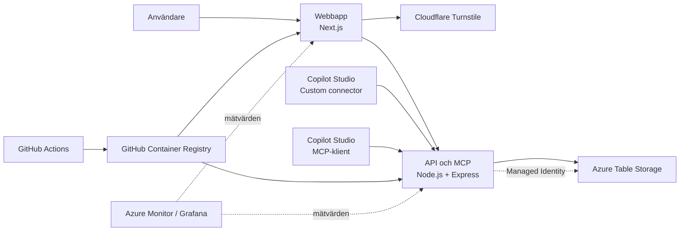

# T-Berg D&U – arkitektur och drift

Det här dokumentet beskriver hur T-Berg D&U är uppbyggt, hur testnycklar fungerar och vilka gränser som finns i tjänsten. Beskrivningen gäller den publicerade miljön i Azure den 30 augusti 2026.

T-Berg D&U är ett fiktivt drift- och underhållssystem för utbildning. Det innehåller objekt, tekniker, felhistorik och arbetsordrar. Deltagarna kan använda samma testnyckel i webbgränssnittet, en REST-baserad custom connector och MCP.

## Översikt



Systemet består av två publika Azure Container Apps:

| Del | Resurs | Adress | Uppgift |
| --- | --- | --- | --- |
| Webb | `ca-tberg-du-web` | `https://ca-tberg-du-web.orangesmoke-45b4d851.swedencentral.azurecontainerapps.io` | Skapar testnycklar och visar deltagarens arbetsyta. |
| API och MCP | `ca-tberg-du-api` | `https://ca-tberg-du-api.orangesmoke-45b4d851.swedencentral.azurecontainerapps.io` | Validerar nycklar, exponerar REST-endpoints och kör MCP-verktyg. |

Båda apparna ligger i Container Apps-miljön `cae-tberg-du-demo-swc` i Sweden Central. De använder 0,25 vCPU och 0,5 GiB minne, kan skala ned till noll och har högst en aktiv replik.

## Åtkomst och testnycklar

Tjänsten har ingen vanlig användarinloggning och sparar inga användarkonton. Åtkomsten bygger i stället på en tidsbegränsad testnyckel. Den som har nyckeln kan använda arbetsytan tills nyckeln löper ut eller anropskvoten är slut.

Så skapas en nyckel:

1. Besökaren öppnar webbappen och genomför Cloudflare Turnstile-kontrollen.
2. Webbappen skickar Turnstile-token till `POST /access/sessions`.
3. API:t verifierar token hos Cloudflare. Svaret måste komma från rätt hostname och får bara gälla åtgärden `issue-test-key`.
4. API:t skapar en slumpmässig nyckel med prefixet `tberg_` och en separat arbetsyta med prefixet `DEMO-`.
5. API:t returnerar nyckeln till webbläsaren. Webbläsaren sparar den i `localStorage` så att sidan kan återansluta till samma arbetsyta.
6. Servern sparar endast nyckelns SHA-256-hash. Den okrypterade nyckeln lagras inte i Azure Table Storage.

Alla skyddade REST- och MCP-anrop skickar nyckeln i samma header:

```http
x-workshop-key: tberg_...
```

Nyckeln fungerar som ett åtkomstbevis. Den ska inte läggas i Git, skärmbilder eller öppet kursmaterial. Om användaren väljer **Avsluta** tas nyckeln bort från den aktuella webbläsaren, men den fortsätter att vara giltig på serversidan tills den löper ut eller förbrukas.

### Gränser

Standardgränserna sätts som miljövariabler i API-appen:

| Gräns | Värde | Vad den innebär |
| --- | ---: | --- |
| Giltighetstid | 24 timmar | Därefter går nyckeln och arbetsytan inte längre att använda. |
| Anropskvot | 500 | Varje skyddat HTTP-anrop räknas, även anrop till MCP-endpointen. |
| Arbetsordrar | 20 | Gränsen gäller det totala antalet arbetsordrar i arbetsytan, inklusive de tre startposterna. |
| Allmän hastighetsgräns | 600 anrop per minut och IP-adress | Skyddar alla API-rutter mot stora anropsmängder. |
| Nya testmiljöer | 50 per timme och IP-adress | Begränsar hur många nycklar som kan skapas från samma nätverk. |
| Storlek på JSON-anrop | 1 MB | Större request bodies avvisas. |

Hastighetsgränserna ligger i API-processens minne. De nollställs när containern startas om eller har skalat ned till noll. Turnstile, nyckelkvoten och gränsen per arbetsyta ligger kvar som separata skydd.

## Arbetsytor och lagring

Varje testnyckel får ett eget `workspaceId`. Arbetsordrar lagras med arbetsytans ID som partition key, vilket gör att en deltagare inte kan läsa eller ändra en annan deltagares arbetsordrar med sin egen nyckel.

Azure-läget använder lagringskontot `sttbergdudemo8053`, ett StorageV2-konto med Standard LRS och TLS 1.2. Tre tabeller skapas vid behov:

| Tabell | Innehåll |
| --- | --- |
| `TbergAccessSessions` | Hashad nyckel, arbetsyte-ID, giltighetstid och förbrukad anropskvot. |
| `TbergWorkspaces` | Arbetsytans livslängd. |
| `TbergWorkOrders` | Startposter och arbetsordrar som skapats via webben, REST eller MCP. |

Objektregistret, reservdelskatalogen, teknikernas kompetenser och den äldre felhistoriken är demodata i applikationens kod. Teknikernas nästa tillgängliga tid räknas från tiden för anropet. Statusen `Upptagen` räknas fram från arbetsordrar som pågår i deltagarens arbetsyta. Startarbetsordrarnas datum räknas från tiden då arbetsytan skapas. En ändring av själva demouppgifterna kräver en ny container-version. Testnycklar, arbetsytor och arbetsordrar ligger i Table Storage och finns kvar när en container startas om.

API-appen använder en systemtilldelad Managed Identity med rollen `Storage Table Data Contributor`. Ingen anslutningssträng eller lagringskontonyckel behöver därför ligga i appens konfiguration.

Utgångna sessioner och deras arbetsordrar tas bort när API:t startar och därefter var femtonde minut. Rensningen körs också när en ny session skapas eller en nyckel används. Knappen **Återställ** tar bort deltagarens egna arbetsordrar och återskapar de tre startposterna.

## REST-API och custom connector

REST-API:t används av webbgränssnittet och kan användas av ett custom connector i Copilot Studio.

| Metod och sökväg | Funktion |
| --- | --- |
| `GET /health` | Publik hälsokontroll. |
| `POST /access/sessions` | Skapar en testnyckel efter Turnstile-verifiering. |
| `GET /access/session` | Kontrollerar nyckeln och visar återstående kvot. |
| `GET /api/assets` | Hämtar alla objekt. |
| `GET /api/assets/{assetId}` | Hämtar auktoritativ information om ett objekt. |
| `GET /api/assets/{assetId}/history` | Hämtar objektets felhistorik. |
| `GET /api/technicians` | Hämtar tekniker och räknar ut deras status från arbetsytans order. |
| `GET /api/work-orders` | Hämtar arbetsytans arbetsordrar. |
| `POST /api/work-orders` | Skapar en arbetsorder i arbetsytan. |
| `POST /api/reset` | Återställer arbetsytans arbetsordrar. |

OpenAPI-filen `openapi/tberg-du-connector.swagger.json` är avsedd för kursens custom connector. Den exponerar två operationer:

- `GetAsset` gör samma objektuppslag varje gång och returnerar bland annat kritikalitet, SLA, garanti, serviceform och kompetenskrav.
- `CreateWorkOrder` skapar en arbetsorder efter att agentens godkännandeflöde har godkänt underlaget. Arbetsytan bestäms av testnyckeln och skickas därför inte som indata.

MCP-serverns `create_work_order` finns kvar för andra agentlösningar. I kursens agent stängs verktyget av, så att skrivningen bara kan ske genom det godkända flödet och connectorns `CreateWorkOrder`.

Filen använder API-appens Azure-hostname och `https`. Power Platform importerar custom connectors från OpenAPI 2.0. Säkerhetsdefinitionen i filen anger API-nyckel i headern `x-workshop-key`.

### Objekt-ID

Alla objekt-ID följer formatet `LO-TT-NNN`:

- `LO` markerar ett Lyserno-objekt.
- `TT` är en tvåställig typkod, exempelvis `PU` för pump eller `VA` för ventilation.
- `NNN` är ett tresiffrigt löpnummer.

Exempel: `LO-PU-017` och `LO-VA-012`. Formatet skiljer objekt från felkoder som `E-42`, tekniker som `T-101` och arbetsordrar som `AO-1048`. Objektregistret kontrollerar formatet och dubbla ID:n när API:t startar.

## MCP

MCP använder Streamable HTTP på:

```text
POST https://ca-tberg-du-api.orangesmoke-45b4d851.swedencentral.azurecontainerapps.io/mcp
```

Samma `x-workshop-key` används som för REST-API:t. Servern är stateless: varje HTTP-anrop validerar nyckeln och kopplas till rätt arbetsyta.

Copilot Studios MCP-guide stöder Streamable HTTP och API-nyckel i en header. I onboarding-guiden anges därför serveradressen ovan, autentiseringstypen **API key**, typen **Header** och namnet `x-workshop-key`.

MCP-servern exponerar fyra verktyg:

| Verktyg | Uppgift | Skriver data |
| --- | --- | --- |
| `get_fault_history` | Hämtar objektets äldre underhållshistorik och tidigare arbetsordrar i deltagarens arbetsyta. En felkod räknar matchningar utan att dölja övriga poster. | Nej |
| `find_available_technicians` | Söker tekniker med rätt kompetens som inte är frånvarande eller arbetar med en pågående order. Färre planerade order går före nästa tillgängliga tid. | Nej |
| `find_spare_parts` | Kontrollerar reservdelar för interna objekt när driften är stoppad eller samma felkod har förekommit tidigare. Returnerar lager och ledtid utan att reservera något. | Nej |
| `create_work_order` | Skapar en arbetsorder i deltagarens arbetsyta. | Ja |

`create_work_order` kräver parametern `approved: true`. Det ersätter inte ett riktigt godkännandeflöde, men hindrar verktyget från att skriva innan agentens topic eller flow har genomfört kursens bekräftelse- och godkännandesteg.

Teknikerns lagrade grundstatus är `Tillgänglig` eller `Frånvarande`. API:t visar `Upptagen` när teknikern har en arbetsorder med status `Pågår`. En tilldelad P1-order börjar som `Pågår`; en tilldelad P2–P4-order börjar som `Planerad`. En order utan tekniker får status `Väntar`.

`find_spare_parts` tar emot objekt-ID, påverkan och `sameErrorCodeCount` från `get_fault_history`. Servern gör bara kontrollen om objektet har intern service och påverkan är `Stoppad` eller antalet tidigare träffar för samma felkod är större än noll. Resultatet kan läggas i arbetsorderns befintliga `description` och visas i bekräftelsemejlet.

## Nätverk och hemligheter

Webbappen och API:t har publik HTTPS-ingress. CORS för API:t är begränsat till webbappens Azure-adress. Custom connectors och MCP-klienter använder server-till-server-anrop och autentiserar sig med testnyckeln.

Turnstile Site Key är publik och finns i webbappens miljövariabler. Turnstile Secret Key ligger som en Container App-secret i API-appen och läses via en `secretRef`. Hemligheten finns inte i GitHub-repot eller container-imagen.

Lagringskontot är åtkomligt över Azures publika nätverk, men det ger inte anonym tillgång till tabellerna. API:t autentiserar sig mot Table Storage med Microsoft Entra ID och Managed Identity.

## Bygge och publicering

Källkoden ligger under `services/t-berg-du`. När dessa filer ändras på `main` kör GitHub Actions arbetsflödet `publish-tberg-du-containers.yml`.

Arbetsflödet bygger två container-images och publicerar dem i GitHub Container Registry:

- `ghcr.io/tyto-official/tberg-du-web`
- `ghcr.io/tyto-official/tberg-du-api`

Varje image märks både med `latest` och med commitens fullständiga SHA. GitHub Actions publicerar images, men uppdaterar inte Azure automatiskt. Azure Container Apps måste därför pekas på den nya versionsmärkta imagen med distributionsskriptet eller Azure CLI.

## Övervakning och kostnadskontroll

Container Apps-miljön sparar inte applikationsloggar till Log Analytics. Det minskar risken för en oväntad loggkostnad, men innebär också att felsökning främst får ske via containerstatus, revisionsstatus och externa tester.

Azure Monitor kan fortfarande visa plattformsmätvärden. Den exporterade Grafana-dashboarden innehåller paneler för bland annat:

- antal anrop och HTTP-statuskoder;
- antal repliker och omstarter;
- CPU- och minnesanvändning;
- inkommande och utgående nätverkstrafik.

Grafana-filen är en dashboarddefinition och innehåller inga sparade mätvärden. Den behöver en Azure Monitor-datakälla och val av prenumeration, resursgrupp och Container App för att visa data.

Resursgruppen har en månadsbudget på 150 i prenumerationens faktureringsvaluta. Budgeten stoppar inte resurserna när gränsen nås, utan används för aviseringar.

## Lokal utveckling

Lokalt används samma API, MCP-server och webbapp. Skillnaderna är:

- data sparas i `.data/runtime.json` i stället för Azure Table Storage;
- en särskild utvecklingstoken ersätter Turnstile när appen inte körs i produktionsläge;
- standardadresserna är `http://localhost:3000` för webben och `http://localhost:8787` för API och MCP.

Utvecklingstoken accepteras inte i produktionsläge.

## Avgränsningar

T-Berg D&U är byggt för utbildning, inte för verkliga driftärenden.

- Nyckeln identifierar en arbetsyta, inte en fysisk person.
- Systemet har ingen rollstyrning, återkallningsfunktion för en enskild nyckel eller fullständig revisionslogg.
- Masterdata är fiktiv och ligger i koden.
- Hastighetsgränserna är lokala för den aktiva API-processen.
- Plattformen använder varken API Management, Key Vault, SQL Database, Cosmos DB eller Application Insights.

De här avgränsningarna håller miljön billig och begriplig under utbildningen. En produktionslösning skulle normalt använda organisationens identitet, mer detaljerad behörighetsstyrning, central loggning och tydliga regler för lagring och borttagning av data.
